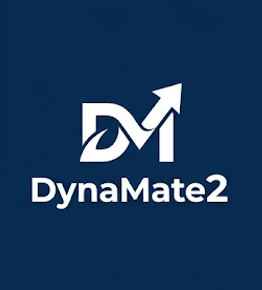

# DynaMate2

<p align="center">
  
</p>

**DynaMate2** is a dynamic multi-agent framework built on [LangGraph](https://github.com/langchain-ai/langgraph) that lets users register new Python functions as agent tools and create new specialist agents at runtime — through natural language prompts — without restarting the system. All tools, agents, and conversation history are persisted to disk and restored automatically on the next session.

A **Prompt Enhancer** layer sits between the user and the Supervisor. It reads the live pool state and rewrites each raw user query with explicit routing hints — agent names and relevant tool names — so users never need to know internal names to get correct routing.

Originally developed as a research framework for molecular simulation workflows (MACE force fields, ASE MD, PACKMOL box building), DynaMate2 is general-purpose: any Python function with a docstring can become a callable tool.

---

## Table of Contents

- [Quick Start (CRC users — shared container already built)](#quick-start-crc-users--shared-container-already-built)
- [Run DynaMate2](#run-dynamate2)
  - [Connecting from Windows (PowerShell)](#connecting-from-windows-powershell)
- [Multi-user data: private vs. shared state](#multi-user-data-private-vs-shared-state)
- [Architecture Overview](#architecture-overview)
- [Project Structure](#project-structure)
- [Tutorial](#tutorial)
- [Usage](#usage)
  - [Interactive CLI](#interactive-cli)
  - [Web UI (React)](#web-ui-react)
  - [Gradio Web UI (legacy)](#gradio-web-ui-legacy)
  - [Single Prompt](#single-prompt)
  - [Using as a Python Library](#using-as-a-python-library)
- [Local Development Setup](#local-development-setup)
- [How Persistence Works](#how-persistence-works)
  - [Where Tool Source Code and Simulation Output Files Are Saved](#where-tool-source-code-and-simulation-output-files-are-saved)
- [Core Concepts](#core-concepts)
- [Adding Tools and Agents](#adding-tools-and-agents)
- [Running Tests](#running-tests)
- [Troubleshooting: Common Errors and How to Avoid Them](#troubleshooting-common-errors-and-how-to-avoid-them)
- [Limitations](#limitations)

---

## Quick Start (CRC users — shared container already built)

If you're joining this group on Notre Dame's CRC cluster, someone has already built and
shared a working container — you don't need to build, pull, or download anything yourself.
(If that's not you — e.g. a fresh cluster, or you want your own copy of the image — skip to
[Run DynaMate2](#run-dynamate2) below instead.)

**One-time setup:**

1. Clone the repo:
   ```bash
   git clone https://github.com/omendibleba/DynaMate2.git
   cd DynaMate2
   ```
2. Add your OpenAI API key:
   ```bash
   cp .env_sample .env
   # then edit .env and set OPENAI_API_KEY = 'sk-...'
   ```
   (Ask whoever manages this deployment whether to use a shared lab key or your own.)
3. Point your clone at the already-built shared container — this just links to it, no
   download happens:
   ```bash
   mkdir -p containers
   ln -sf /groups/ycolon/Orlando/containers/dynamate2_gpu.sif containers/dynamate2_gpu.sif
   ln -sf /groups/ycolon/Orlando/containers/dynamate2_cpu.sif containers/dynamate2_cpu.sif
   ```

**Every time you want to use the UI:**

4. Get onto a GPU compute node the usual way for this cluster.
5. Launch:
   ```bash
   cd DynaMate2
   ./run.sh --gpu      # or ./run.sh for the lightweight CPU-only UI (no GPU needed)
   ```
6. From your own machine, open a tunnel and browse. In PowerShell:
   ```powershell
   ssh -L 8888:localhost:8888 <your-username>@<gpu-node-hostname>
   ```
   (or jump through the login node if direct SSH to compute nodes isn't allowed for you —
   see [Connecting from Windows (PowerShell)](#connecting-from-windows-powershell) for both
   forms.) Then open `http://localhost:8888` in your browser.

That's it. Since everyone clones their own copy in step 1, each person automatically gets
their own private tools/agents/conversation history — see
[Multi-user data](#multi-user-data-private-vs-shared-state) if you actually want to share
that instead. `containers/*.sif` is gitignored, so the symlinks from step 3 are yours to
keep — no risk of accidentally committing or affecting anyone else's clone.

**Bringing your own function that needs a library not already in the image?** (e.g.
running a workshop/tutorial where each person brings different functions) The container's
own filesystem is read-only at runtime, so a missing library normally means editing the
`Dockerfile`, waiting for a full rebuild, and rebuilding the `.sif` — far too slow to do
live, per person, mid-session. Add `--writable` to get an ephemeral writable overlay for
that one session instead, so `pip install <package>` actually works (run it yourself, or
just ask the agent to run it via `shell_agent`):

```bash
./run.sh --gpu --writable      # or ./run.sh --writable for the CPU image
```

This needs to be set when you **launch** — if `run.sh` is already running without it,
stop that session (`Ctrl+C`) and relaunch with the flag; there's no way to add it to an
already-running session. Nothing installed this way survives past that one session —
it's for unblocking a live session, not a substitute for adding the library to the
`Dockerfile` for real afterward (do that once the workshop's over). Apptainer/Singularity
only; under Docker this is a no-op since Docker containers are already writable by default.

See [`MISSING_LIBRARY_EXAMPLE.md`](MISSING_LIBRARY_EXAMPLE.md) for a full worked example
of this, start to finish — clone, hit the missing-library error, relaunch with
`--writable`, install it, retry successfully — including why the fix has to happen
*through the agent* rather than from a second terminal.

---

## Run DynaMate2

The fastest way to get the UI running locally — one command, on a regular machine (Docker) or
an HPC cluster (Apptainer/Singularity — no Docker daemon needed):

```bash
export OPENAI_API_KEY=sk-...
./run.sh
```

Open `http://localhost:8888` once it prints ready. No conda environment, no separate PACKMOL
install, no matching a CUDA driver by hand — everything DynaMate2 needs (PACKMOL, the MACE
CLI tools, the full Python/LLM stack) is already baked into the image `run.sh` pulls from
`ghcr.io/omendibleba/dynamate2`.

Don't want to clone the repo first? `run.sh` is self-contained:
```bash
curl -fsSL https://raw.githubusercontent.com/omendibleba/DynaMate2/main/run.sh | bash
```

| What | How |
|---|---|
| Different port | `DYNAMATE_PORT=9000 ./run.sh` |
| Persistent data | `./dynamate-data/` by default (chat/tool state + tutorial files) — override with `DYNAMATE_DATA_DIR` |
| API key | `OPENAI_API_KEY` env var, or a `.env` file next to `run.sh` |
| On a remote HPC node | Forward the port to your own machine first — see [Connecting from Windows (PowerShell)](#connecting-from-windows-powershell) below, or your site's remote-desktop tooling — before `http://localhost:8888` will load |

### Connecting from Windows (PowerShell)

DynaMate2's port is only reachable from the node it's actually running on — from your own
Windows machine, `http://localhost:8888` won't load until you open an SSH tunnel to that
node first. Windows 10/11 ships an OpenSSH client usable directly from PowerShell, no extra
install needed.

1. **On the remote side**: start DynaMate2 as usual (`./run.sh` or `./run.sh --gpu`) and
   note which node it's actually running on (your terminal prompt, or `hostname`).
2. **On your own machine, in PowerShell** — pick whichever matches how you normally reach
   this cluster:
   ```powershell
   # If you can SSH directly to the node running DynaMate2:
   ssh -L 8888:localhost:8888 <your-username>@<node-hostname>

   # If your site only allows direct SSH to a login node, which can itself reach the
   # compute node (common on HPC clusters — e.g. Notre Dame's CRC: login crcfe01/crcfe02,
   # compute nodes like qa-a10-032.crc.nd.edu), forward through it by naming the compute
   # node as the middle segment instead of localhost:
   ssh -L 8888:<compute-node-hostname>:8888 <your-username>@<login-node-hostname>
   ```
   Using a different port (`DYNAMATE_PORT=...`)? Replace every `8888` above with that port,
   consistently. Leave this PowerShell window open for as long as you want the UI reachable
   — closing it (or losing the connection) closes the tunnel.
3. **Open your browser** (on your own machine) to `http://localhost:8888`.

(VS Code's Remote-SSH/Remote Tunnel extensions do the same port-forwarding automatically
through their Ports panel, if you'd rather not manage a separate terminal.)

**GPU / HPC scheduler use:** `run.sh` always runs the lightweight CPU-only image by default,
so it starts fast and needs no GPU just to open the UI.
- `./run.sh --gpu` runs the CUDA-enabled image directly (needs an NVIDIA GPU + driver on
  whatever machine you run it on).
- On an HPC cluster, the running (CPU) session can instead submit a scheduler job that runs
  the GPU image on an allocated GPU node — see `docker/job-templates/` for adaptable SGE and
  Slurm starting points (queue names and resource-request syntax are site-specific, so these
  are templates to edit, not drop-in scripts).

**Running `--gpu` directly on a GPU compute node (not via a submitted job)?** Some clusters
restrict `ptrace` on compute nodes (`/proc/sys/kernel/yama/ptrace_scope` = `2`, a kernel-wide
admin policy) but not on the CPU-only login/front-end node. Unprivileged Apptainer needs
`ptrace` (via `proot`) to convert a `docker://` image into a local `.sif` the first time it
runs one — so `./run.sh --gpu` run *directly on such a compute node* fails with
`proot error: ptrace(TRACEME): Operation not permitted`, even though the exact same command
works fine on the login node. Confirmed on Notre Dame's CRC cluster: `ptrace_scope=2` on GPU
compute nodes, `=0` on the login node (`crcfe01`/`crcfe02`) — CRC support confirmed (Sep
2026) this is a kernel-level restriction not fixable short of a kernel update, and the
supported path is pre-building on the login node first. Check
`cat /proc/sys/kernel/yama/ptrace_scope` on your compute node — `2` means you need the
workaround below; `0` or `1` means `./run.sh --gpu` just works directly, nothing else needed.

Workaround — pre-build the image into a `.sif` file on the login node once, then run
`run.sh` as normal on the GPU node: it **auto-detects** a `.sif` at
`containers/dynamate2_<gpu|cpu>.sif` next to itself and uses it instead of `docker://`, so no
pull/build happens there at all — no ptrace needed, and no other flags to remember:

```bash
# 1) On the CPU-only login/front-end node, once:
cd /path/to/DynaMate2       # this repo
mkdir -p containers
apptainer pull containers/dynamate2_gpu.sif docker://ghcr.io/omendibleba/dynamate2:gpu
#   (swap :gpu / dynamate2_gpu.sif for :latest / dynamate2_cpu.sif for the CPU image)

# 2) Get onto a GPU compute node the usual way for your cluster.

# 3) On the GPU node — same one-command launch as always:
cd /path/to/DynaMate2
export OPENAI_API_KEY=sk-...   # or rely on a .env file next to run.sh, as usual
./run.sh --gpu

# 4) From your own machine, forward the port and open http://localhost:8888 --
#    see "Connecting from Windows (PowerShell)" above.
```

The `.sif` file (several GB) is already covered by `.gitignore` — no need to exclude it
manually. Re-run step 1 whenever a new image is published (`docker-publish.yml` tags
`:gpu`/`:latest` on every push to `main`) to pick up the update; the local `.sif` doesn't
update itself.

<details>
<summary>Why this needs no other Apptainer flags (technical note, not required reading)</summary>

Unlike Docker, Apptainer starts a container in the *host's* current working directory by
default rather than the image's own `WORKDIR` — running `run.sh` from inside an actual repo
clone (which has its own unbuilt `server.py`/`frontend/` at the same relative paths as the
image) would otherwise silently run the *host's* `server.py` instead of the image's, since
`python server.py`'s bare filename resolves against whatever directory the process started
in. `run.sh` already passes `--pwd /app` to work around this — nothing to do here, just
documented in case a stray `frontend/dist/ not found` error ever reappears despite the image
clearly having one.

</details>

**Sharing one `.sif` across a group instead of everyone pulling their own** — recommended if
your AFS/home quota is tight: Apptainer's *build cache* (`~/.apptainer/cache`, separate from
the final `.sif` destination) can consume several GB per pull and defaults to your home
directory regardless of where the `.sif` itself ends up — redirect it too, or every user who
pulls their own hits the same quota risk:

```bash
# Build once, into shared storage, with the build cache redirected off AFS home too:
export APPTAINER_CACHEDIR=/path/to/shared/storage/containers/.apptainer-cache
mkdir -p "$APPTAINER_CACHEDIR"
apptainer pull /path/to/shared/storage/containers/dynamate2_gpu.sif \
  docker://ghcr.io/omendibleba/dynamate2:gpu
```

Each user then either symlinks it into their own clone (so the auto-detection above just
works, no flags):
```bash
ln -sf /path/to/shared/storage/containers/dynamate2_gpu.sif containers/dynamate2_gpu.sif
```
or points at it directly without touching their own clone at all:
```bash
DYNAMATE_SIF_PATH=/path/to/shared/storage/containers/dynamate2_gpu.sif ./run.sh --gpu
```

---

## Multi-user data: private vs. shared state

`run.sh`'s persistent data directory (`./dynamate-data` by default, override with
`DYNAMATE_DATA_DIR`) holds everything a session accumulates: registered tools
(`ui_state/tools/*.py`), dynamically created agents and tool assignments
(`ui_state/pool_state.json`), and full conversation history (`ui_state/conversations.db`).

- **Each user keeps their own tools/agents/conversations (recommended default for multiple
  people on the same cluster)**: give each user their own data directory — nothing to change
  in the app itself, just point `DYNAMATE_DATA_DIR` somewhere per-user before launching, e.g.:
  ```bash
  export DYNAMATE_DATA_DIR=/path/to/shared/storage/dynamate-data-$(whoami)
  ./run.sh --gpu
  ```
- **Multiple users sharing one pool of tools/agents (everyone can use tools/agents anyone
  else added)**: pointing everyone's `DYNAMATE_DATA_DIR` at the *same* directory works, but
  **only safely if people take turns, not if two users run the UI at the same time.**
  `pool_state.json` is written as a full snapshot of one process's in-memory state on every
  change, with no locking or merging — if two separate `run.sh` instances (each its own
  container, each its own in-memory pool) are both live against the same data directory, the
  second one to save silently overwrites whatever the first one added, since it never saw it.
  Conversation history (`conversations.db`, SQLite, one row per chat thread) doesn't have
  this problem — different users' threads don't collide — so that part *is* safe to share
  concurrently on its own.
  **True concurrent shared tool/agent state would need real code changes** (e.g. locking +
  merge-on-save in `PoolStore`, or one shared backend process serving every user's browser
  instead of one container per user) — not implemented yet; ask if this is actually needed
  before relying on simultaneous shared use.

See [How Persistence Works](#how-persistence-works) for the full mechanism this builds on.

---

## Architecture Overview

DynaMate2 is organised as a four-tier pipeline:

```
User prompt  (natural language — no tool/agent names required)
    │
    ▼
PromptEnhancer                ← rewrites query with routing hints
    │                            (reads live pool state on every call)
    ▼
Supervisor                    ← routes tasks to the right agent
    ├── ToolManager           ← manages the pool (register, assign, add agents)
    └── [domain agents...]    ← created at runtime, persisted across sessions
              │
              ▼ example
         mace_md_specialist   ← runs MACE/ASE simulations
           ├── download_mace_model
           ├── smiles_to_xyz
           ├── packmol_build_system
           ├── run_nvt_md
           └── plot_nvt_trajectory
              ▲
         AgentPool  (shared state)
         ├── _tool_registry   {tool_name → StructuredTool}
         ├── _source_registry {tool_name → source_code}   [persistent layer]
         ├── _agents          {name → {model, base_tools, extra_tools, ...}}
         └── _supervisor      current compiled supervisor graph
```

**Rebuild cost summary:**

| Operation | Rebuild cost |
|---|---|
| Assign a tool to an agent | Rebuilds **only that agent** |
| Add a new agent to the pool | Rebuilds **that agent + the supervisor** |
| Register a tool (no assignment) | No rebuild |
| Remove a tool | Rebuilds **all agents that had it assigned** |
| Remove an agent | Rebuilds **the supervisor** |

---

## Project Structure

```
DynaMate2/
├── run.sh                         # One-command launcher (Docker or Apptainer/Singularity)
├── Dockerfile                     # CPU (default) + GPU image variants, one file, build ARGs
├── main.py                        # CLI entry point
├── server.py                      # React UI production entry point
├── app.py                         # Gradio web UI (legacy — gradio-ui-legacy branch)
├── .env                           # OPENAI_API_KEY (not committed)
├── .env_sample                    # Template for .env
├── environment.yml                # Recommended conda environment (local dev)
├── environment_pinned.yml         # Fully-pinned conda environment (local dev, exact reproduction)
├── requirements.txt               # pip requirements (local dev)
│
├── docker/
│   ├── environment.cpu.yml        # CPU image's conda environment
│   ├── environment.gpu.yml        # GPU image's env — same flexible deps as the CPU one;
│   │                               #   torch is installed separately in the Dockerfile from
│   │                               #   PyTorch's cu121 wheel index instead of the CPU index
│   └── job-templates/             # Adaptable SGE/Slurm scripts to run the GPU image as a job
│
├── .github/workflows/
│   └── docker-publish.yml         # Builds + publishes both images to GHCR on push
│
├── backend/                       # FastAPI backend for the React UI
│   ├── main.py                    # App + lifespan (builds the pool once at startup)
│   ├── routes/                    # health, status, threads, chat, quickstart, tools
│   ├── state.py                   # ui_state/ paths, thread-index helpers
│   ├── streaming.py               # SSE bridge for pool.supervisor.stream()
│   ├── quickstart.py              # Tutorial-mirroring prompt strings
│   └── schemas.py                 # Pydantic request/response models
│
├── frontend/                      # React + TypeScript + Tailwind UI (Vite)
│   └── src/
│       ├── components/            # ChatPanel, QuickStartPanel, StatusSidebar, …
│       ├── hooks/useChatStream.ts # Drives one chat turn (SSE)
│       └── lib/api.ts             # Typed backend client
│
├── dynamate/                      # Core package
│   ├── __init__.py                # Public exports
│   ├── pool.py                    # AgentPool, AgentPoolWithSupervisor
│   ├── tool_manager.py            # build_tool_manager_v2 factory
│   ├── prompt_enhancer.py         # PromptEnhancer (query rewriting layer)
│   ├── dynamic_agent.py           # DynamicToolAgent (standalone, no supervisor)
│   ├── persistence.py             # PersistentSaver, PoolStore,
│   │                              # PersistentAgentPoolWithSupervisor
│   └── utils.py                   # pretty_print_messages
│
├── tests/
│   ├── _setup.py                  # Shared fixtures (model, pool builder)
│   ├── test_dynamic_agent.py      # Tests for DynamicToolAgent
│   ├── test_agent_pool.py         # Tests for AgentPool + ToolManager
│   ├── test_add_agent.py          # Tests for dynamic agent addition
│   ├── test_persistence.py        # Tests for cross-session persistence
│   └── agent_tool_diagnostic.py   # Three-level diagnostic helper
│
├── misc/
│   └── show_graph.py              # Pool inspector + Mermaid / PNG output
│
├── ui_state/                      # Auto-created: web UI persistent state (shared by both UIs)
│   ├── pool_state.json
│   ├── conversations.db
│   └── tools/
│
└── tutorials/
    ├── DynaMate2_tutorial.ipynb   # Main tutorial notebook
    ├── tutorial_state/            # Persistent state for the tutorial
    ├── ASE_NVT_PBC.py             # NVT MD tool source (Langevin + MACE)
    ├── smiles_to_xyz.py           # SMILES → XYZ tool source
    ├── packmol_build_system.py    # Packmol box-builder tool source
    ├── pretty_print.py            # Notebook display helper
    ├── models/                    # MACE model files (gitignored — download on first run)
    └── sample_outputs/            # Reference outputs from a completed tutorial run
        ├── dmf.xyz
        ├── dmf_30.xyz / dmf_30.traj / dmf_30.png
        ├── water.xyz / nacl_water_box.xyz
        └── end_to_end_test/       # Full NaCl-water workflow outputs
```

---

## Tutorial

`tutorials/DynaMate2_tutorial.ipynb` demonstrates a complete molecular simulation workflow driven by natural language:

| Test | Task | Tools used |
|---|---|---|
| **T1** | Download a MACE foundation model | `download_mace_model` |
| **T2** | Build a periodic DMF liquid box (30 molecules) | `smiles_to_xyz`, `packmol_build_system` |
| **T2.1** | Build a NaCl aqueous solution box | `smiles_to_xyz`, `packmol_build_system` |
| **T3** | Run an NVT Langevin MD simulation | `run_nvt_md` |
| **T4** | Plot energies and temperature from the trajectory | `plot_nvt_trajectory` |
| **Integration** | Full end-to-end workflow from a single prompt | all five tools |

All tools are registered and assigned to `mace_md_specialist` through natural language prompts — no tool names need to appear in the user queries.

Reference outputs from a completed run are in `tutorials/sample_outputs/`. Running the notebook regenerates the same files.

**Before running:** download the MACE-POLAR-1-M model once:
```bash
mkdir -p tutorials/models
wget -P tutorials/models https://github.com/ACEsuit/mace-foundations/releases/download/mace_polar_1/MACE-POLAR-1-M.model
```

---

## Usage

### Interactive CLI

Start an interactive session. All tools and agents from previous sessions are restored automatically:

```bash
python main.py
```

Output:
```
Building system  [model=gpt-4.1-mini, state=.dynamate] ...
State restored — 5 tool(s), 1 dynamic agent(s), 5 assignment(s).
Ready.

DynaMate session  [thread: a3f9b1c2]
Agents: ['tool_manager', 'mace_md_specialist']
Tools in registry: ['download_mace_model', 'smiles_to_xyz', ...]
Type 'status' to inspect the pool, 'exit' to quit.

>>>
```

### Web UI (React)

The current web UI — a FastAPI backend (`backend/`) with a React + TypeScript +
Tailwind frontend (`frontend/`), replacing the earlier Gradio UI per reviewer
feedback. Same functionality as before (quick-start actions mirroring the
tutorial notebook, streaming chat, tool upload, thread history, live agent/tool
status) behind a more usable interface.

**Recommended: [`./run.sh`](#run-dynamate2)** — no local build step, no conda environment.

**Without a container** (after [Local Development Setup](#local-development-setup)):
```bash
cd frontend && npm install && npm run build && cd ..
python server.py
```
Starts at `http://localhost:8888`. State is saved to `ui_state/` and restored
between sessions, same as `run.sh`.

**Development (hot-reload on both sides):**
```bash
uvicorn backend.main:app --reload --port 8000      # terminal 1
cd frontend && npm install && npm run dev            # terminal 2, proxies /api -> :8000
```
Open the Vite dev URL it prints (`http://localhost:5173`).

Node.js is required for the frontend; if it isn't already on your `PATH`,
`conda install -c conda-forge nodejs` into your environment.

**Environment variables** (all optional):

| Variable | Default | Purpose |
|---|---|---|
| `DYNAMATE_PORT` | `8888` | Port `server.py` binds to |
| `DYNAMATE_MODEL` | `gpt-4o-mini` | OpenAI model for the supervisor/agents |
| `DYNAMATE_STATE_DIR` | `ui_state/` | Where tools/agents/conversations are persisted — point this at a scratch directory to run a from-scratch walkthrough (e.g. the tutorial's T1–T4 flow) without touching real state: `DYNAMATE_STATE_DIR=/tmp/dynamate_test_state python server.py` |

### Gradio Web UI (legacy)

The original Gradio interface is preserved on the `gradio-ui-legacy` branch for
anyone who prefers it:
```bash
git checkout gradio-ui-legacy
python app.py
```
Starts at `http://localhost:8888`. Uses the same `ui_state/` as the React UI —
switching between the two preserves your tools, agents, and conversation
history.

### Single Prompt

```bash
python main.py --prompt "What tools are currently registered?"
```

### CLI Options

| Flag | Default | Description |
|---|---|---|
| `--model` | `gpt-4.1-mini` | OpenAI model name |
| `--state-dir` | `.dynamate/` | Directory for persisted state |
| `--thread-id` | random UUID | Conversation thread — reuse to continue a prior session |
| `--prompt` | — | Run one prompt and exit |
| `--verbose` | off | Print all messages, not just the last |
| `--status` | off | Print pool status and exit |

### Using as a Python Library

```python
from dynamate import (
    PersistentAgentPoolWithSupervisor,
    PersistentSaver,
    PoolStore,
    PromptEnhancer,
    build_tool_manager_v2,
    pretty_print_messages,
)
from langchain_openai import ChatOpenAI

model = ChatOpenAI(model="gpt-4.1-mini", temperature=0.0)

# Set up persistence
saver      = PersistentSaver("my_state/conversations")
pool_store = PoolStore("my_state/pool_state.json")

# Build the pool
pool = PersistentAgentPoolWithSupervisor(
    supervisor_model=model,
    pool_store=pool_store,
    checkpointer=saver,
)

tool_manager = build_tool_manager_v2(pool, model)
pool.set_system_agents([tool_manager])

# Restore previous session
pool.restore_state(model_factory=lambda name: ChatOpenAI(model=name, temperature=0.0))

# Build the prompt enhancer
enhancer = PromptEnhancer(model=model, pool=pool)

# Stream a prompt
raw_query = "List all agents and their tools"
enhanced  = enhancer.enhance(raw_query)

config = {"configurable": {"thread_id": "my-thread"}}
for chunk in pool.supervisor.stream(
    {"messages": [{"role": "user", "content": enhanced}]},
    config=config,
    recursion_limit=25,
):
    pretty_print_messages(chunk, last_message=True)
```

---

## Local Development Setup

Only needed if you're developing DynaMate2 itself, or genuinely can't use a container runtime
— **prefer [`./run.sh`](#run-dynamate2)** otherwise. The manual path has real complications
worth knowing before you start: `environment_pinned.yml` pins 260+ conda packages including a
full CUDA stack, PACKMOL is an external binary (not pip-installable), and matching a working
GPU driver / CUDA version by hand is its own project — the container sidesteps all of this.

```bash
git clone https://github.com/omendibleba/DynaMate2.git
cd DynaMate2
conda env create -f environment.yml   # or environment_pinned.yml for exact reproducibility
conda activate dynamate
conda install -c conda-forge packmol  # not pip-installable
cp .env_sample .env                   # then edit in your OPENAI_API_KEY
python -c "from dynamate import AgentPool; print('OK')"   # sanity check
```

(`pip install -r requirements.txt` works too if you'd rather not use conda, minus the PACKMOL
binary — you'd need to build or download that separately either way.)

---

## How Persistence Works

### What is Persisted

| What | Storage | Survives restart? |
|---|---|---|
| Registered tool **source code** | `pool_state.json` | ✓ Yes |
| Dynamic agent **name + system_prompt + model** | `pool_state.json` | ✓ Yes |
| Tool-to-agent **assignments** | `pool_state.json` | ✓ Yes |
| **Conversation history** (per thread_id) | `conversations.db` (SQLite) | ✓ Yes |

### What is Not Persisted

| What | Why |
|---|---|
| The supervisor graph itself | Compiled Python object — rebuilt at startup by replaying `pool_state.json` |
| In-flight / partial LLM responses | Only committed LangGraph checkpoints are saved |

### Implementation Details

**Layer 1 — Pool State (`pool_state.json`)**

Managed by `PoolStore` and `PersistentAgentPoolWithSupervisor` in `dynamate/persistence.py`:

```json
{
  "tools": {
    "run_nvt_md": "def run_nvt_md(model_path, structure_file, ...) ..."
  },
  "dynamic_agents": {
    "mace_md_specialist": {
      "system_prompt": "You are a specialist in MACE...",
      "model_name": "gpt-4.1-mini"
    }
  },
  "assignments": {
    "mace_md_specialist": ["download_mace_model", "smiles_to_xyz", "run_nvt_md", ...]
  }
}
```

`_autosave()` is called synchronously after every mutation (add, assign, remove), so the file is always current.

**Layer 2 — Conversation History (`conversations.db`)**

`PersistentSaver` is a thin subclass of `SqliteSaver` from `langgraph-checkpoint-sqlite`. All LangGraph checkpoints and intermediate writes are stored in two tables managed by `SqliteSaver.setup()`.

### Startup Restoration Sequence

```
1. Create PersistentSaver     → open SQLite DB
2. Create PoolStore           → read pool_state.json
3. Create PersistentAgentPoolWithSupervisor
4. Build ToolManager          → closures bind to live pool
5. pool.set_system_agents()   → first supervisor build
6. pool.restore_state()
   ├── Re-exec each saved tool source  → repopulate _tool_registry
   ├── Recreate each dynamic agent     → trigger supervisor rebuild
   └── Re-apply each assignment        → rebuild only target agent
7. PromptEnhancer(model, pool) → queries pool live on every enhance() call
```

### Where Tool Source Code and Simulation Output Files Are Saved

Two separate things live under the persistent data directory (`./dynamate-data/` by
default when launched via `run.sh` — see [Run DynaMate2](#run-dynamate2) — or `ui_state/`
directly when running `python server.py`/`main.py` without a container):

| What | Default location (relative to the persistent data dir) |
|---|---|
| Registered **tool source code** (`.py` files, human-editable) | `ui_state/tools/<name>.py` |
| Pool state (agents, assignments — `pool_state.json`) | `ui_state/pool_state.json` |
| Conversation history | `ui_state/conversations.db` |
| **Simulation/tutorial output files** (XYZ structures, trajectories, plots, packmol boxes — anything a tool writes when you give it an `output_path`/`output_file`) | `tutorials/` |

**To change where *everything* is saved** (all of the above at once, e.g. to point at
shared/larger storage): set `DYNAMATE_DATA_DIR` before launching —
`export DYNAMATE_DATA_DIR=/path/to/somewhere; ./run.sh`. See the
[Run DynaMate2](#run-dynamate2) table and [Multi-user data](#multi-user-data-private-vs-shared-state)
for the per-user-vs-shared implications of this.

**To direct one specific simulation's output to its own subfolder**, no config needed —
just ask for that path in your prompt, same as the tutorial's own quickstart prompts do
(`backend/quickstart.py`'s `_tut()` helper does exactly this). For example:
> "...save the result to `tutorials/nacl_run_2/box.xyz`."

Every tool that writes a file takes an explicit output-path argument, and the agent uses
whatever path you give it — including a brand-new subfolder name that doesn't exist yet
(`smiles_to_xyz`, `packmol_build_system`, and `run_nvt_md` all create missing parent
directories automatically).

**Important constraint under the container deployment (Docker or Apptainer)**: only paths
under `tutorials/` or `ui_state/` are both writable *and* persisted — these are the two
directories `run.sh` bind-mounts from the host. A path outside both of those (e.g. a bare
filename with no directory prefix, or something like `/app/dynamate-data/...` which isn't
an actual mount point) will fail with `Read-only file system` — the container's own root
filesystem is read-only by design. When asking the agent to save somewhere custom, always
give a path under `tutorials/` (or the absolute equivalent, `/app/tutorials/...`).

---

## Core Concepts

### AgentPool

`dynamate/pool.py`

Shared state object. Holds named agents and a global tool registry.

```python
pool = AgentPool()
pool.add_agent("my_agent", model, base_tools=[])
pool.register_tool_from_code("def my_func(...): ...")
pool.assign_tool("my_func", "my_agent")
```

### AgentPoolWithSupervisor

`dynamate/pool.py`

Extends `AgentPool`. Owns the supervisor graph and rebuilds it automatically when agents are added or removed.

```python
pool = AgentPoolWithSupervisor(model)
pool.add_agent(...)
tm = build_tool_manager_v2(pool, model)
pool.set_system_agents([tm])   # first supervisor build
```

### ToolManager

`dynamate/tool_manager.py`

A dedicated ReAct agent that manages the pool. It exposes nine tools via closure over the pool:

| Tool | Description |
|---|---|
| `register_tool_from_code` | Register functions from a code string |
| `register_tool_from_file` | Register functions from a `.py` file |
| `assign_tool_to_agent` | Assign a registered tool to a named agent |
| `add_agent_to_pool` | Create a new agent |
| `remove_tool_from_registry` | Unregister a tool and unassign it from all agents |
| `remove_agent_from_pool` | Remove a dynamic agent |
| `list_registered_tools` | List tools in the global registry |
| `list_agent_tools` | List tools for a specific agent |
| `list_agents` | List all agents in the pool |

### PromptEnhancer

`dynamate/prompt_enhancer.py`

A lightweight LLM layer that rewrites user queries with routing hints before they reach the Supervisor.

```python
enhancer = PromptEnhancer(model=model, pool=pool)
raw      = "Run an NVT simulation with this structure file..."
enhanced = enhancer.enhance(raw)
# → "...Use mace_md_specialist — it should use run_nvt_md to complete the request.
#    All required input files are already present. Call run_nvt_md directly..."
```

**Routing rules (in priority order):**

| Rule | Trigger | Action |
|---|---|---|
| **A** | Message mentions a `.py` file path | Route to `tool_manager` → `register_tool_from_file`; chain `assign_tool_to_agent` if assignment requested |
| **B** | Message contains `def ` function definition | Route to `tool_manager` → `register_tool_from_code` |
| **2** | Single-tool request (run, compute, convert) | Append `"Use <agent> — call <tool> directly"` |
| **3** | Explicit multi-step request ("build AND run") | Chain `"First <tool_X>, then <tool_Y>"` |

**Key properties:**

| Property | Detail |
|---|---|
| Context | `_build_pool_context()` queries the live pool on every call |
| LLM call | Single `model.invoke()` — no ReAct loop |
| Fallback | Returns input unchanged if pool has no agents |
| State | Stateless — holds only a model reference and a pool reference |

### DynamicToolAgent

`dynamate/dynamic_agent.py`

A simpler, standalone ReAct agent that can register new tools at runtime without a supervisor. Useful for simple single-agent workflows.

```python
agent = DynamicToolAgent(model, base_tools=[])
agent.stream({"messages": [{"role": "user", "content": "Add def foo..."}]})
```

**Note:** Does not have persistence. Stateless across process restarts.

### PersistentAgentPoolWithSupervisor

`dynamate/persistence.py`

Extends `AgentPoolWithSupervisor` with automatic save/restore. Overrides `add_agent`, `register_tool_from_code`, `assign_tool`, `remove_tool`, and `remove_agent` to write `pool_state.json` after every mutation.

---

## Adding Tools and Agents

All of the following can be done through natural language prompts. The Supervisor routes them to the ToolManager automatically.

### Register a Tool from a Code String

```
>>> Please register this Python function as a tool:

def boltzmann_energy(temperature_K: float) -> str:
    """Compute thermal energy kT in eV for a given temperature in Kelvin."""
    kT = 8.617333e-5 * temperature_K
    return f"kT at {temperature_K} K = {kT:.6f} eV"
```

**Rules for registrable functions:**
- Must have a **docstring** — this becomes the tool description for the LLM
- Must be a **top-level** function
- All imports must be inside the function body (functions are executed via `exec()` in an isolated namespace)

### Register Tools from a File

```
>>> Load all tools from /path/to/my_tools.py
```

To also assign:

```
>>> Register the tools in /path/to/my_tools.py and assign run_nvt_md to mace_md_specialist
```

### Add a New Agent

```
>>> Create a new agent called mace_md_specialist whose job is to run
    MACE molecular dynamics simulations using ASE.
```

### Assign Tools to Agents

```
>>> Assign run_nvt_md to mace_md_specialist
```

The same tool can be assigned to multiple agents. Only the target agent is rebuilt.

### Remove a Tool

```
>>> Remove the boltzmann_energy tool
```

Every agent that had the tool assigned is rebuilt. The tool is removed from `pool_state.json`.

### Remove an Agent

```
>>> Remove mace_md_specialist from the pool
```

The supervisor is rebuilt. Any tools assigned to the removed agent remain in the registry.

---

## Running Tests

```bash
# DynamicToolAgent: add tools from code and file
python tests/test_dynamic_agent.py

# AgentPool + ToolManager: register and assign tools
python tests/test_agent_pool.py

# Dynamic agent addition: add a new agent via the supervisor
python tests/test_add_agent.py

# Persistence: cross-session save and restore (no LLM calls)
python tests/test_persistence.py
```

`test_dynamic_agent`, `test_agent_pool`, and `test_add_agent` make real LLM API calls and require a valid `OPENAI_API_KEY`. `test_persistence` does not make LLM calls.

---

## Troubleshooting: Common Errors and How to Avoid Them

Errors actually hit (and fixed) while deploying and using DynaMate2 on a real shared
cluster. Grouped by where you'll encounter them.

### Deployment (building/running the container)

| Error | Cause | Fix |
|---|---|---|
| `proot error: ptrace(TRACEME): Operation not permitted` | Some HPC clusters block unprivileged `ptrace` on GPU compute nodes (a kernel policy), which Apptainer needs to pull/build a `docker://` image the first time it runs one. | Pre-build the `.sif` on the CPU-only login node, run that local file on the compute node — see [Run DynaMate2](#run-dynamate2). `run.sh` auto-detects a local `.sif` and skips the pull/build step entirely. |
| `no space left on device` during `apptainer pull` | Apptainer's *build cache* (`~/.apptainer/cache`) defaults to your home directory regardless of where the final `.sif` goes — a full/tight home quota fails the pull even with plenty of room at the destination. | Redirect the cache before pulling: `export APPTAINER_CACHEDIR=/path/to/shared/storage/.apptainer-cache`. |
| `frontend/dist/ not found` (even though the image has one) | Unlike Docker, Apptainer starts the container in the *host's* current directory, not the image's own `WORKDIR`. Launching from inside an actual repo clone (which has its own unbuilt `server.py`/`frontend/`) silently runs the *host's* copy instead. | Already fixed — `run.sh` passes `--pwd /app` under Apptainer. If you ever invoke `apptainer run`/`exec` manually, always include `--pwd /app`. |
| `FileNotFoundError` deep in `ssl.create_default_context` (via `httpx`) | Apptainer inherits the invoking shell's environment by default. Some users' own conda `base` environment exports `SSL_CERT_FILE` pointing at a host-side cert bundle path, which doesn't exist inside the container. | Already fixed — `run.sh` unsets `SSL_CERT_FILE`/`SSL_CERT_DIR`/`REQUESTS_CA_BUNDLE`/`CURL_CA_BUNDLE` before launching under Apptainer. |
| `Failed to send compressed multipart ingest ... 401 Unauthorized` (LangSmith) | `LANGSMITH_TRACING=true` with no valid `LANGSMITH_API_KEY` — LangChain's SDK tries to upload traces regardless. Not a DynaMate2 feature; harmless but noisy. | Set `LANGSMITH_TRACING=false` in your `.env` (already the `.env_sample` default) unless you have your own LangSmith account. |
| `No module named '<some_package>'` after adding/changing a tool that uses a new library | The library (or an extra dependency it needs beyond its main PyPI package — e.g. `mace_polar`'s checkpoints needing the separate `graph_electrostatics` package) isn't installed in the image's conda env. | For a real, permanent fix: add the `pip install` to the `Dockerfile`, push, wait for CI to publish a new image, then rebuild the `.sif`. To unblock a live session right now instead (e.g. mid-tutorial, one person's function needs something): `./run.sh --writable` (or `--gpu --writable`) gives that session an ephemeral writable overlay so `pip install <package>` actually works — see [Run DynaMate2](#run-dynamate2). Nothing installed this way persists past that session. |

### `Read-only file system: '<filename>'` when a tool runs

The container's own root filesystem is read-only by design — only `tutorials/` and
`ui_state/` are writable (bind-mounted from the host). This error means a tool tried to
write somewhere else, almost always one of:
- **A bare filename with no directory** (e.g. `nvt.log`, `packmol_input.inp`) — some tool
  parameters default to a bare filename, which resolves under the container's read-only
  `/app` root if left unspecified. **Always give every file-output parameter an explicit
  path under `tutorials/`** when prompting — see
  [Where Tool Source Code and Simulation Output Files Are Saved](#where-tool-source-code-and-simulation-output-files-are-saved).
  If you're adding a new tool yourself, use `tempfile.mkstemp()` for any scratch/intermediate
  file instead of a bare relative name (see `tutorials/packmol_build_system.py`).
- **A path that looks plausible but isn't an actual mount point** — e.g. `/app/dynamate-data/...`
  (that name only exists on the *host* side; inside the container it's split into
  `/app/tutorials` and `/app/ui_state`).
- **A brand-new subfolder that doesn't exist yet** — as of this fix, `smiles_to_xyz`,
  `packmol_build_system`, and `run_nvt_md` all auto-create missing parent directories, but
  any tool you add yourself should do the same (`os.makedirs(os.path.dirname(...), exist_ok=True)`).

### The agent says a tool is "already registered/exists" and does nothing, when you asked for an update

Phrasing like *"update it if it already exists"* or *"these are already registered but I'd
like to update them"* has been observed causing the model to treat "a tool by this name
already exists" as a reason to stop, rather than actually calling
`register_tool_from_code`/`register_tool_from_file` to compare and apply the new source.
The response reads like a status report ("The tool X was already registered and assigned
...") rather than confirmation of a real action taken.

**Fix**: phrase re-registration as an unconditional imperative, and say explicitly not to
skip it:
> "Please **re-register** the tool defined in `tutorials/<file>.py` — call
> `register_tool_from_file` with this path **now**, even if a tool by this name already
> exists, since the file's contents may have changed. **Do not skip this** just because
> the tool already exists."

If in doubt whether it actually worked, check the response for an explicit "Registered" /
"Updated" / "re-registered" confirmation — not just a description of current state.

### A quick general rule

Most of the errors above trace back to one of two things: **giving a tool an implicit
(default) path instead of an explicit one**, or **phrasing a request so the model can
plausibly interpret it as "nothing to do."** When in doubt, be explicit and unconditional:
name every output path yourself, and say directly what action you want taken rather than
describing the current state and hoping the model infers the rest.

---

## Limitations

### Functional Limitations

**Tool functions must be self-contained.**
Functions registered via `register_tool_from_code` run in an isolated `exec()` namespace. All imports and dependencies must be inside the function body:

```python
# ✓ Works
def compute_something(x: float) -> str:
    """Compute something."""
    import numpy as np
    return str(np.sqrt(x))

# ✗ Fails — 'np' is not in the exec namespace
import numpy as np
def compute_something(x: float) -> str:
    """Compute something."""
    return str(np.sqrt(x))
```

**Tools cannot be updated in place.**
Re-registering a function with the same name is silently skipped. To update a tool, remove it first (`remove_tool_from_registry`), then re-register.

**New dynamic agents start with no base tools.**
All capabilities must come from assigned tools.

### Simulation Limitations

**MACE is much faster on a GPU.**
Running MACE simulations on CPU (the default `./run.sh` image) is technically possible but
orders of magnitude slower. Use `./run.sh --gpu`, or submit a scheduler job running the `:gpu`
image (see [Run DynaMate2](#run-dynamate2)), for real workloads.

**PACKMOL must be on `PATH`.**
The `packmol_build_system` tool calls the `packmol` binary from the system PATH — already
bundled in both container images; if you're on the [manual local setup](#local-development-setup)
instead, install it yourself (`conda install -c conda-forge packmol`) or that tool will fail
at runtime.

### Persistence Limitations

**Conversation history grows indefinitely.**
The `conversations.db` SQLite database accumulates checkpoint rows across sessions. There is no built-in pruning. Inspect and manage with any SQLite tool:
```bash
sqlite3 .dynamate/conversations.db
```

**No concurrent access.**
`pool_state.json` is written without file locking. Running two sessions simultaneously against the same `--state-dir` may corrupt the state file.

### Model Limitations

**The Prompt Enhancer adds one extra LLM call per user turn.**
For bulk scripting or latency-sensitive use cases, bypass the enhancer by passing the raw query directly to `pool.supervisor.stream()`.

**Tool docstrings are critical.**
The LLM decides which tool to call based entirely on the docstring. Vague or missing docstrings cause incorrect or absent tool calls.

**Model context limits.**
Very long conversations can approach the model's context window. Use separate `--thread-id` values for distinct tasks.
